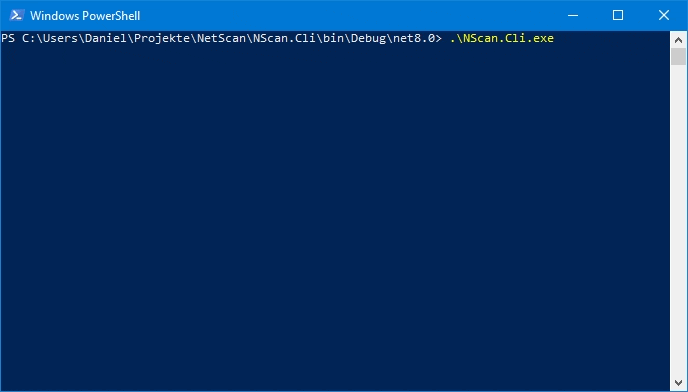

# NetScan

NetScan is a port scanner that can be used to scan a range of IP addresses and ports. It is lightweight, cross-platform, and easy to use. NetScan supports multithreading and asynchronous operations which makes it fast and efficient. It has no dependencies and can be run on any system that supports .NET Core.



## Installation

To get started, download the latest release from the [releases page](https://github.com/dan-koller/netscan/releases). NetScan is a single executable file, so you can run it directly from the command line or by double-clicking it in the file explorer (on Windows).

### Building from Source

If you want to build NetScan from source, you can clone the repository and build it using the .NET Core SDK. NetScan is written in C# and uses the .NET 8.0 runtime.

```bash
git clone https://github.com/dan-koller/netscan.git
cd netscan
dotnet build
dotnet run --project NScan.Cli/NScan.Cli.csproj
```

## Usage

I hope it is self-explanatory, but here is a quick rundown of the features and how to use them.

### Scanning

You can choose between 3 different scan modes:

-   Multit-hreaded: This mode uses a separate thread for each IP address and port combination. It is the fastest mode but can be resource-intensive. By default, it will scan `localhost` on ports `1-1024`.

-   Single-threaded: Same as the multithreaded mode, but only uses a single thread. It is slower but uses fewer resources.

-   Custom: This mode allows you to specify the IP addresses, ports to scan, and the timeout for each scan.

### Output

After the scan is complete, the results will be displayed in the terminal. You will see the elapsed time, the number of open ports, and a list of the open ports for the specified IP address.

## Contributing

If you find a bug or have a feature request, please open an issue. If you want to contribute, feel free to fork the repository and submit a pull request.

## License

This project is licensed under the MIT License - see the [LICENSE](LICENSE) file for details.
